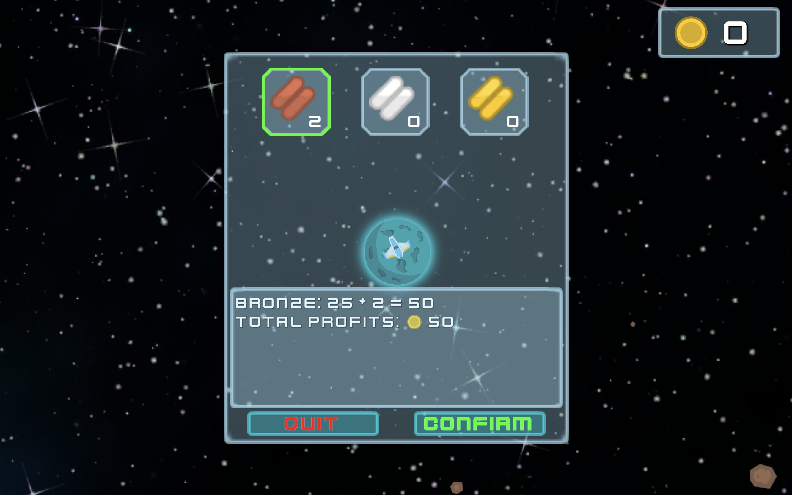

# Asteroid Miner

WIP of an Asteroid Miner clone. Example footage of the original game can be found [here](https://www.youtube.com/watch?v=v1fseBg0E-g).

## Please Note!
This repo does not contain any of the actual asset files used in the project in order to keep its size small; only the files required by Unity to open and edit the project, and the C# code written to implement various aspects of the game. As such, it is not possible to build the project from this repo.

## Features Currently Implemented
The clone currently has the following features:
- Spaceship movement, including drifting when the thrusters are no longer active
- Firing bullets (including pew pew sound effect :grin:)

- Spaceship collisions with meteors - bounces off, with sound effects
- Bullets hitting asteroids, with explosions and sound effects

- Material gathering - currently bronze, silver and gold materials
- Inventory screen to show the current quantities of each material and amount of money held by the player

- Main menu

- Planets and selling materials that have been collected from asteroids

## Coming Soon
The following features will be implemented soon:
- Score, fuel and damage stats
- Upgrading the ship
- Enemies
- And more...

This project also has a web-page [here](https://kaitlenw.github.io/asteroid-miner.html).

